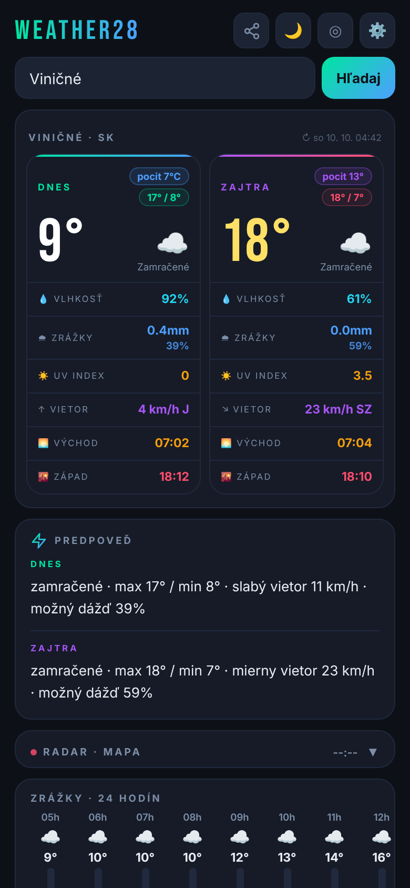
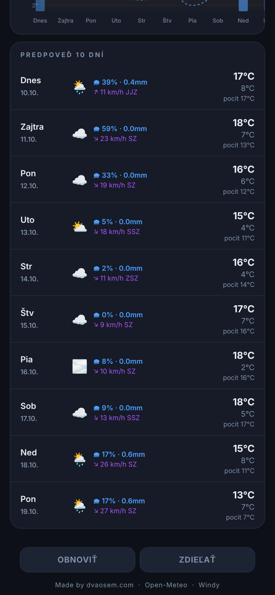
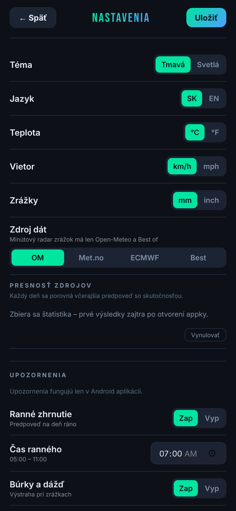
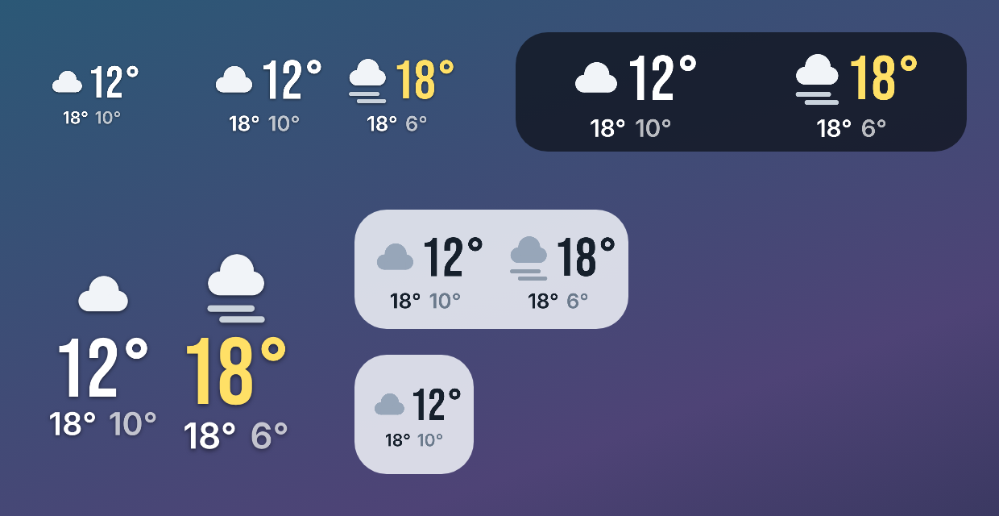

<p align="center">
  
  
  
</p>

# Weather28

A fast, no-nonsense weather app for Slovakia, made by [dvaosem](https://dvaosem.com).
Runs as a single-file web app at **[dvaosem.com/weather28.html](https://dvaosem.com/weather28.html)**
and as an Android app with a home-screen widget, weather alerts and in-app updates.

The interface is in Slovak (English can be switched on in settings).

## Features

- **Today & tomorrow at a glance** – temperature, feels-like, humidity, rain, UV, wind, sunrise/sunset
- **Four data sources** – Open-Meteo, MET Norway, ECMWF, or **Best of** (median of all three, majority-vote weather icon)
- **Source accuracy tracking** – compares yesterday's forecast of each source with what really happened
- **24-hour and 10-day forecast** with charts, minute-by-minute rain banner when rain is coming
- **Rain radar** (RainViewer) with a Windy fallback
- **Short text forecast** generated locally from the data (no AI service, no backend)
- **Favourite places**, share card as an image, dark/light theme, card order and show/hide

### Android extras

- **Home-screen widget** from 1×1 up: today + tomorrow, uses the same data source as the app,
  dark / light / transparent styles with adjustable opacity and "liquid glass" intensity,
  rain note on tall widgets ("Dážď o 15:00")
- **Morning summary** notification at an exact time you choose
- **Weather alerts** – official SHMÚ warnings for your district (via MeteoAlarm),
  plus forecast-based alerts for thunderstorms, strong gusts, heavy rain and heavy snow
- **In-app updates** – the app checks this repository's releases and installs new builds

<p align="center">
  
</p>

## Install (Android)

1. Download `weather28.apk` from the [latest release](https://github.com/dvaosem/weather28/releases/latest).
2. Open it on your phone and allow installing apps from your browser / file manager when asked.
3. Later updates: **Nastavenia → Aktualizácia → Aktualizovať** inside the app.

Requires Android 8.0 (API 26) or newer. Releases are **debug-signed** builds from GitHub Actions –
see [Security](#security).

## Build it yourself

No Android Studio needed – every push to `main` is built by
[GitHub Actions](.github/workflows/build-apk.yml), which uploads the APK as an artifact and publishes
it as release `build-<run number>`.

Locally (JDK 17):

```bash
./gradlew assembleDebug
# → app/build/outputs/apk/debug/app-debug.apk
```

## How it's built

| Part | Where |
|---|---|
| App UI (HTML/CSS/JS, one file) | [`app/src/main/assets/weather28.html`](app/src/main/assets/weather28.html) – loaded in a WebView |
| Bridge between web UI and Android | [`ui/MainActivity.kt`](app/src/main/java/com/dvaosem/weather28/ui/MainActivity.kt) (`AndroidBridge`) |
| In-app updates | [`ui/UpdateManager.kt`](app/src/main/java/com/dvaosem/weather28/ui/UpdateManager.kt) |
| Widget data (same sources as the app) | [`widget/WeatherFetcher.kt`](app/src/main/java/com/dvaosem/weather28/widget/WeatherFetcher.kt) |
| Widget drawing (bitmaps with the app fonts) | [`widget/WidgetRenderer.kt`](app/src/main/java/com/dvaosem/weather28/widget/WidgetRenderer.kt), [`widget/WeatherWidget.kt`](app/src/main/java/com/dvaosem/weather28/widget/WeatherWidget.kt) |
| Notifications | [`widget/WeatherAlertWorker.kt`](app/src/main/java/com/dvaosem/weather28/widget/WeatherAlertWorker.kt), [`widget/AlertScheduler.kt`](app/src/main/java/com/dvaosem/weather28/widget/AlertScheduler.kt) |

There is no server of its own: everything is fetched directly from the public APIs below, and
settings stay on the device (localStorage / SharedPreferences).

## Data & credits

- Weather data: [Open-Meteo](https://open-meteo.com) (CC BY 4.0), including ECMWF IFS forecasts
- Weather data: [MET Norway / api.met.no](https://api.met.no) (CC BY 4.0)
- Official warnings: [SHMÚ](https://www.shmu.sk) via [MeteoAlarm](https://meteoalarm.org)
- Radar: [RainViewer](https://www.rainviewer.com), fallback map by [Windy](https://www.windy.com)
- Maps: [Leaflet](https://leafletjs.com), basemaps © [CARTO](https://carto.com/attributions),
  map data © [OpenStreetMap](https://www.openstreetmap.org/copyright) contributors
- Place names: [Nominatim](https://nominatim.org) / OpenStreetMap (ODbL)
- Fonts: [Bebas Neue](https://fonts.google.com/specimen/Bebas+Neue) and [Inter](https://rsms.me/inter/),
  SIL Open Font License 1.1 – see [`licenses/`](licenses/)

## Security

- Release APKs are signed with a **debug key that is committed in this repo**
  (`app/debug.keystore`). That keeps updates working across CI builds, but it also means anyone
  could sign an APK with the same key. Only install Weather28 from this repository's releases
  or from inside the app.
- The CARTO key in the HTML is a public client-side basemap key.
- Found a problem? Open an issue or write to the address on [dvaosem.com](https://dvaosem.com).

## License

Code: [MIT](LICENSE) © Michal Pohrebovič ([dvaosem](https://dvaosem.com)).
Fonts and data keep their own licenses listed above.
